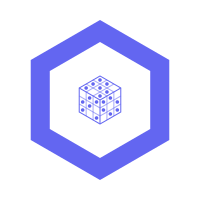

<p align="center">
  
</p>

<h1 align="center">Krypton Runtime</h1>

<p align="center">
  Kubernetes-native serving for AI agents, self-hosted LLMs, and MCP servers.
</p>

<p align="center">
  <a href="https://github.com/kryptonhq/runtime/actions/workflows/ci.yml"></a>
  <a href="https://codecov.io/gh/kryptonhq/runtime"></a>
  <a href="https://github.com/kryptonhq/runtime/releases"></a>
  <a href="https://www.kryptonhq.com/docs/"></a>
  <a href="go.mod"></a>
  <a href="LICENSE"></a>
</p>

Krypton lets platform teams run AI workloads as ordinary Kubernetes
resources. Declare an `Agent` or `Model`, let the controller create the
workload, and send traffic through stable HTTP, A2A, MCP, or
OpenAI-compatible endpoints.

## What it does

| Capability | What you get |
| ---------- | ------------ |
| **Agents** | Run A2A, MCP, or plain HTTP containers with an `Agent` CRD. Bring LangGraph, Google ADK, custom services, or your own image. |
| **Self-hosted LLMs** | Run Hugging Face GGUF models with llama.cpp using a `Model` CRD and OpenAI-compatible `/v1/models` and `/v1/chat/completions` routes. |
| **MCP servers** | Host native HTTP MCP servers, or wrap stdio MCP binaries with the bundled `mcp-stdio-bridge`. |
| **Gateway routing** | One public gateway handles agent invocation, model routing, streaming responses, and protocol-specific paths. |
| **Operator UI** | A lightweight control-plane UI lists agents, models, status, and MCP tools. |
| **Scaling signals** | Per-pod sidecars enforce concurrency, expose in-flight counts, and feed the scaler. |
| **Observability** | Prometheus metrics for gateway traffic, model calls, sidecar load, scaler decisions, and control-plane health. |
| **Helm-first install** | Install the runtime as a single OCI Helm chart and keep ingress, TLS, auth, and rate limiting in your existing platform layer. |

## Quickstart

Install Krypton:

```bash
helm install krypton oci://ghcr.io/kryptonhq/charts/krypton \
  --namespace krypton-system \
  --create-namespace
```

Deploy the no-secrets helloworld agent:

```bash
kubectl apply -f https://raw.githubusercontent.com/kryptonhq/runtime/main/examples/agent/python/helloworld/agent.yaml
kubectl -n krypton-system port-forward svc/krypton-gateway 8080:8080 &
```

Invoke it through the gateway:

```bash
curl -X POST http://localhost:8080/v1/agents/agents/helloworld/ \
  -H 'Content-Type: application/json' \
  -d '{"jsonrpc":"2.0","id":"1","method":"message/send",
       "params":{"message":{"messageId":"m1","role":"user",
       "parts":[{"kind":"text","text":"ping"}]}}}'
```

Open the operator UI:

```bash
kubectl -n krypton-system port-forward svc/krypton-control-plane 8090:8090
open http://localhost:8090/ui/
```

## Try an LLM

```bash
kubectl create ns models --dry-run=client -o yaml | kubectl apply -f -
kubectl apply -f https://raw.githubusercontent.com/kryptonhq/runtime/main/config/samples/llm/qwen2.5-0.5b.yaml

curl -s http://localhost:8080/v1/models | jq
```

Any OpenAI SDK can use `http://localhost:8080/v1` as its `base_url`.

## Local development

### Prerequisites

Go 1.25 and Docker are the only hard requirements for the inner loop.
Everything else is per-task:

| Tool | Needed for |
| ---- | ---------- |
| Go 1.25 | building, unit tests |
| Docker | store tests, image builds, kind |
| pnpm + Node 22 | the operator UI and its tests |
| kubectl, helm, kind | chart tests, e2e, the dev cluster |

Install the pinned dev tooling into `bin/` (golangci-lint, controller-gen,
setup-envtest, gotestsum, kubeconform, chainsaw, plus the helm-unittest
plugin):

```bash
make tools
```

`make help` lists every target.

### Running a cluster

```bash
make deploy-dev        # kind cluster, build, load, helm install, sample agent
make deploy-dev-llm    # the same, plus the Qwen llama.cpp Model sample
make kind-down         # tear it down
```

### Running tests

The suite is split into tiers by **what infrastructure is real**. Start with
the fast one — it needs nothing but Go:

```bash
make test           # unit tier: ~15s, no Docker, no cluster
```

Then the tier that matches what you touched:

```bash
make test-envtest   # controllers/CRDs — real kube-apiserver + etcd, no cluster
make test-store     # the Postgres store — boots a throwaway container
make test-helm      # the Helm chart — lint, kubeconform, 54 template tests
make test-ui        # the React UI — vitest + Testing Library + MSW
make test-e2e       # everything, on a real kind cluster (~10 min)

make test-all       # every tier except e2e
```

Coverage lands in `coverage/`, one profile per tier:

```bash
make cover          # merge the tiers and print the combined total
make cover-html     # same, plus an HTML report at coverage/index.html
```

Lint and the drift gates:

```bash
make lint            # golangci-lint (includes the tagged e2e/envtest suites)
make verify-codegen  # fails if deepcopy or the chart's CRD copies are stale
```

#### First-run notes

- `make test-envtest` downloads a kube-apiserver and etcd into `bin/k8s/` on
  first use. That's automatic, but it's a ~100 MB download.
- `make test-store` starts Postgres via Docker and leaves it running.
  Tear it down with
  `docker compose -f hack/docker-compose.postgres.yml down -v`, or point
  `KRYPTON_TEST_POSTGRES_DSN` at your own database to skip the container
  entirely.
- `make test-e2e` builds six images and loads them into kind, so the first
  run is slow. While iterating:

  ```bash
  KEEP_CLUSTER=true make test-e2e   # leave the cluster up afterwards
  SKIP_BUILD=true  make test-e2e    # reuse images already loaded into kind
  DEPLOY_LLM=true  make test-e2e    # include the llama.cpp path (slow)
  ```

  On failure it writes pod logs, events and CR state to
  `/tmp/krypton-e2e-diagnostics`.

### Where does my test go?

| You changed | Add a test in |
| ----------- | ------------- |
| Pure logic (scaling, routing, sorting) | the package's `_test.go` — unit tier |
| **A field on `AgentSpec`/`ModelSpec`** | **`test/integration/crd_schema_test.go`** — non-negotiable |
| Reconcile behaviour, finalizers, status | `test/integration/` — envtest |
| A chart value that changes rendering | `deploy/helm/krypton/tests/` |
| A control-plane route | a `httptest` unit test, plus `test/e2e/` if user-facing |
| A UI component | an RTL test beside it, querying by role/label |

The CRD row is the one that matters most: `config/crd/bases/*.yaml` are
**hand-written**, so a field with no matching schema property is silently
pruned by the API server — no error, the data is just gone.

[TESTING.md](TESTING.md) has the full breakdown: what envtest can and cannot
assert, the three API quirks the suite pins deliberately, and how coverage is
scoped.

## Learn more

| Resource | Link |
| -------- | ---- |
| Documentation | <https://www.kryptonhq.com/docs/> |
| Examples | [`examples/`](./examples) |
| Helm chart | [`deploy/helm/krypton/`](./deploy/helm/krypton) |
| CRD reference | [`api/v1alpha1/`](./api/v1alpha1) |
| Issues | <https://github.com/kryptonhq/runtime/issues> |

## Status

Krypton is pre-alpha. CRDs, Helm values, gateway paths, and image names
may change before `v1.0`. Pin tagged releases for experiments and expect
breaking changes between early versions.

## License

Apache 2.0. See [LICENSE](./LICENSE).
