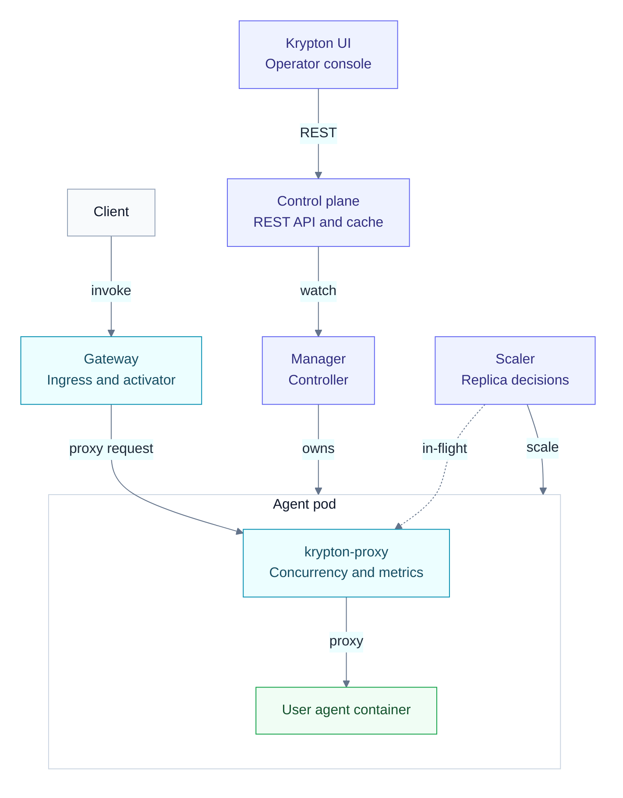

Krypton is composed of four binaries:

| Component        | Role                                                                                                                  |
| ---------------- | --------------------------------------------------------------------------------------------------------------------- |
| **Manager**      | Kubernetes operator. Reconciles `Agent` CRs → Deployments + Services + ServiceAccounts. Runs the scaling decider.    |
| **Control plane**| Read-only HTTP API + the operator UI. Optionally mirrors agents into Postgres for offline querying.                  |
| **Gateway**      | Public ingress. Reverse-proxies invocations to the agent's in-cluster Service.                                       |
| **Sidecar**      | Per-pod `krypton-proxy`. Enforces concurrency, surfaces in-flight count, exposes Prometheus metrics.                 |

## High-level diagram

## Where state lives

| State                          | Source of truth                              |
| ------------------------------ | -------------------------------------------- |
| Agent desired spec             | The `Agent` CR (Kubernetes etcd)             |
| `status.phase`, `replicas`     | Manager writes; readers consume              |
| `status.desiredReplicas`       | Scaler (in manager)                          |
| `status.lastInvocationAt`      | Gateway writes after each invocation         |
| In-flight count                | Sidecar's `/_krypton/inflight` endpoint      |
| Invocation history (later)     | Postgres                                     |

**CRDs are the source of truth.** Postgres is a write-through mirror —
the API serves directly from the informer cache (fresher, no DB hop).

{}
Krypton runs every agent in **always-on** mode by default —
`minReplicas: 1` keeps one pod warm per agent. Scale-from-zero
support is on the [roadmap](/docs/roadmap/).
{}

## Next

For what each component does, how they're wired, and the request
lifecycle through them, see [Components](../components/) and
[Request lifecycle](../request-lifecycle/).
