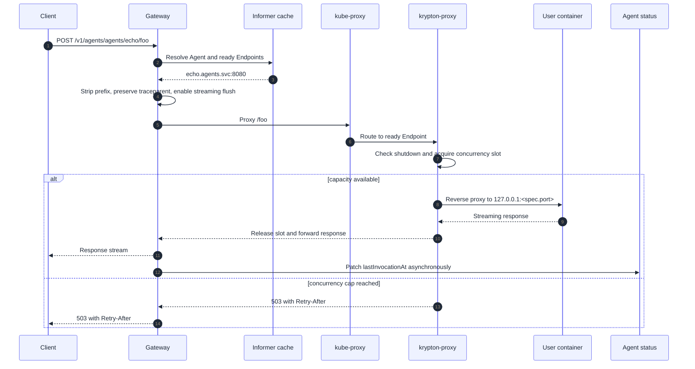
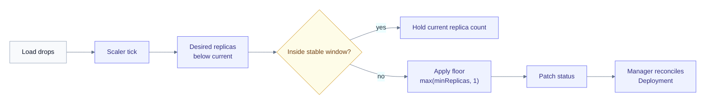

This page walks through what happens between `curl POST .../invocations`
and the JSON coming back.

## Hot path (pod already running)

Typical latency: P50 ~50ms, P95 ~200ms for a 100ms user-handler.

## Scale-up under load

```mermaid
%%{init: {"theme": "base", "flowchart": {"nodeSpacing": 55, "rankSpacing": 70, "diagramPadding": 24}, "themeVariables": {"fontFamily": "Inter, ui-sans-serif, system-ui, sans-serif", "primaryColor": "#eef2ff", "primaryTextColor": "#1f2937", "primaryBorderColor": "#6366f1", "lineColor": "#64748b", "secondaryColor": "#ecfeff", "tertiaryColor": "#f8fafc"}}}%%
flowchart LR
    burst["Burst arrives"] --> cap["Sidecars enforce<br/>spec.concurrency"]
    cap --> refuse["Excess requests get<br/>503 + Retry-After"]
    cap --> poll["Scaler tick<br/>sum in-flight counts"]
    poll --> desired["Compute desired replicas<br/>clamp to min/max"]
    desired --> patch["Patch status"]
    patch --> reconcile["Manager reconciles"]
    reconcile --> deploy["Patch Deployment"]
    deploy --> pods["Kubernetes creates<br/>additional pods"]
    pods --> traffic["New sidecars<br/>take traffic"]

    classDef event fill:#fff7ed,stroke:#f97316,color:#7c2d12;
    classDef control fill:#eef2ff,stroke:#6366f1,color:#312e81;
    classDef runtime fill:#ecfeff,stroke:#0891b2,color:#164e63;
    class burst,refuse event;
    class poll,desired,patch,reconcile control;
    class cap,deploy,pods,traffic runtime;
```

## Scale-down

The sample MCP server in [`examples/mcp/go`](https://github.com/kryptonhq/runtime/tree/main/examples/mcp/go)
demonstrates clean SIGTERM handling for when pods do get terminated —
without it, the pod would exit with status 143 (`Error`) instead of
`Completed`.

## Hysteresis on bursty load

The scaler refuses to scale down within `--scaler-stable-window-ms`
(60s default) of the most recent scale-up. Burst arrives, scales up;
load drops momentarily; scaler holds replica count; load returns —
the runtime didn't churn through pod terminations.
