Krypton lets you serve an LLM the same way you manage the rest of your
cluster: declare a resource, let the controller create the workload, and
send traffic through the gateway.

Krypton serves Hugging Face GGUF models with [llama.cpp][llamacpp]. A
`Model` resource points at a repo and file, the controller creates a
Deployment and Service, and Krypton exposes the model through
OpenAI-compatible endpoints:

- `GET /v1/models`
- `POST /v1/chat/completions`
- `POST /v1/completions`
- `POST /v1/embeddings`

Any OpenAI SDK can use the gateway as its `base_url`.

## The two-minute mental model

| Concept | What it means |
| ------- | ------------- |
| **`Model` CR** | Declares "serve this Hugging Face GGUF as model id `metadata.name`". |
| **Model pod** | Runs `llama-server` with controller-owned `--hf-repo`, `--hf-file`, `--host`, `--port`, and `--alias` flags. |
| **Gateway** | Lists all models at `/v1/models` and routes inference by the request body's `model` field. |

There's no per-model URL to remember. Clients hit one base URL and
pick the model with the standard OpenAI `model` parameter.

{}
Install Krypton first and keep access to the gateway handy. For a local
cluster, you can use `kubectl -n krypton-system port-forward
svc/krypton-gateway 8080:8080`.
{}

## 1. Apply a Model

Two ready-to-go samples ship in
[`config/samples/llm/`](https://github.com/kryptonhq/runtime/tree/main/config/samples/llm).
The smallest one is Qwen2.5 0.5B. It is a good smoke-test model for CPU
clusters because the quantized GGUF is small enough to pull and start
quickly:

```yaml
# config/samples/llm/qwen2.5-0.5b.yaml
apiVersion: krypton.ai/v1alpha1
kind: Model
metadata:
  name: qwen2-0-5b
  namespace: models
spec:
  source:
    huggingface: Qwen/Qwen2.5-0.5B-Instruct-GGUF
    file: qwen2.5-0.5b-instruct-q4_k_m.gguf
  runtime: llama.cpp
  minReplicas: 1
  maxReplicas: 1
  port: 8080
  args: ["--ctx-size", "4096"]
  resources:
    requests: { cpu: "500m", memory: 1Gi }
    limits:   { cpu: "2",    memory: 2Gi }
```

```bash
kubectl create ns models --dry-run=client -o yaml | kubectl apply -f -
kubectl apply -f config/samples/llm/qwen2.5-0.5b.yaml
```

The first start pulls the GGUF file from Hugging Face. Expect a minute
or two before the pod reports `Ready`; larger models can take much
longer depending on network, disk, and CPU.

```bash
kubectl -n models get models
# NAME           RUNTIME     SOURCE                                PHASE   REPLICAS   AGE
# qwen2-0-5b     llama.cpp   Qwen/Qwen2.5-0.5B-Instruct-GGUF       Ready   1          2m
```

## 2. List models through the gateway

```bash
kubectl -n krypton-system port-forward svc/krypton-gateway 8080:8080 &

curl -s http://localhost:8080/v1/models | jq
```

```json
{
  "object": "list",
  "data": [
    {
      "id": "qwen2-0-5b",
      "object": "model",
      "owned_by": "krypton",
      "namespace": "models",
      "source": "hf:Qwen/Qwen2.5-0.5B-Instruct-GGUF/qwen2.5-0.5b-instruct-q4_k_m.gguf"
    }
  ]
}
```

The OpenAI-facing `id` is the `Model` resource name. Keep it
DNS-compatible, because Kubernetes uses it for child Deployments and
Services too.

## 3. Invoke with the OpenAI API

Plain curl:

```bash
curl -s http://localhost:8080/v1/chat/completions \
  -H 'Content-Type: application/json' \
  -d '{
    "model": "qwen2-0-5b",
    "messages": [{"role": "user", "content": "Say hi in one word."}]
  }' | jq
```

…or with the OpenAI Python SDK:

```python
from openai import OpenAI

client = OpenAI(
    base_url="http://localhost:8080/v1",
    api_key="not-used",            # gateway doesn't terminate auth
)

resp = client.chat.completions.create(
    model="qwen2-0-5b",
    messages=[{"role": "user", "content": "Say hi in one word."}],
)
print(resp.choices[0].message.content)
```

## 4. Add a second model

Apply the second sample to see multi-model routing in action:

```bash
kubectl apply -f config/samples/llm/tinyllama-1.1b.yaml
curl -s http://localhost:8080/v1/models | jq '.data[].id'
# "qwen2-0-5b"
# "tinyllama-1-1b"
```

Swap the `model` field between requests — the gateway resolves it to
the right pod each call. No client changes required.

## Routing under the hood

```mermaid
%%{init: {"theme": "base", "flowchart": {"nodeSpacing": 55, "rankSpacing": 70, "diagramPadding": 24}, "themeVariables": {"fontFamily": "Inter, ui-sans-serif, system-ui, sans-serif", "primaryColor": "#eef2ff", "primaryTextColor": "#1f2937", "primaryBorderColor": "#6366f1", "lineColor": "#64748b", "secondaryColor": "#ecfeff", "tertiaryColor": "#f8fafc"}}}%%
flowchart LR
    client["OpenAI client"] --> gateway["Gateway<br/>/v1/chat/completions"]
    gateway --> inspect["Read body.model"]
    inspect --> model["Resolve Model CR"]
    model --> service["Kubernetes Service"]
    service --> llama["llama-server pod"]
    llama --> stream["Stream response"]

    classDef external fill:#f8fafc,stroke:#94a3b8,color:#0f172a;
    classDef traffic fill:#ecfeff,stroke:#0891b2,color:#164e63;
    classDef control fill:#eef2ff,stroke:#6366f1,color:#312e81;
    classDef runtime fill:#f0fdf4,stroke:#16a34a,color:#14532d;
    class client external;
    class gateway,inspect,stream traffic;
    class model control;
    class service,llama runtime;
```



The gateway buffers the request body (≤ 1 MiB), reads the `model`
field, resolves it cluster-wide, and reverse-proxies to the matching
in-cluster Service. Streaming responses (SSE) flow back unaltered.

## Common tuning knobs

Most llama.cpp options go in `spec.args`; Krypton appends them after the
controller-owned networking and Hugging Face flags.

```yaml
spec:
  args:
    - "--ctx-size"
    - "8192"
    - "--parallel"
    - "2"
```

Use `resources` to reserve enough CPU and memory for the quantization
you choose. For gated Hugging Face repos, mount a secret that provides
`HUGGINGFACE_HUB_TOKEN` through `env` or `envFrom`.

## What's next

- [Model CRD reference](../../reference/model-crd/) — every spec field
- [Metrics](../../operations/observability/metrics/) — `krypton_model_invocations_total`
  and friends
- [Roadmap](/docs/roadmap/) — planned model-serving work

[llamacpp]: https://github.com/ggerganov/llama.cpp
