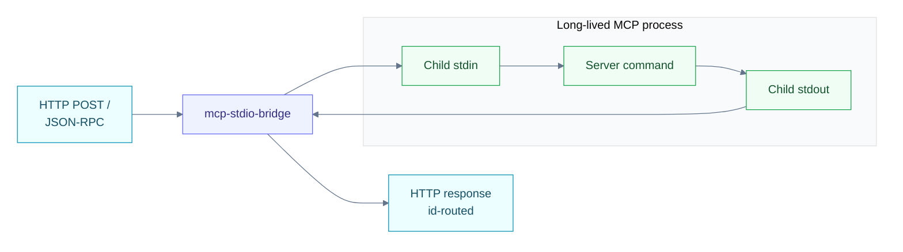

Most published MCP servers (the official `@modelcontextprotocol/server-*`
packages, plenty of community ones) only speak stdio. Krypton can host
them via `mcp-stdio-bridge` — a tiny HTTP-in-front-of-stdio shim that
runs alongside your server inside the same container.

## How it works



- The bridge forks `$MCP_COMMAND` **once** at container startup.
- HTTP requests are serialized to the child's stdin.
- Responses are demultiplexed by JSON-RPC `id`, so concurrent HTTP
  requests don't cross-talk.
- Notifications (no `id`) are fire-and-forget.
- One-shot stdio servers (process-per-call) aren't supported — the
  child must be long-lived.

## Deploy

The published bridge image is a pure-Go binary on `distroless/static`.
That's enough for stdio binaries that are themselves statically linked.
For runtime-dependent servers (Node, Python), layer the runtime onto a
derived image first.

### Minimal example (Node + `npx`)

```dockerfile
# Dockerfile
FROM krypton/mcp-stdio-bridge:latest AS bridge
FROM node:22-slim
COPY --from=bridge /app /app
USER 65532
ENTRYPOINT ["/app"]
```

```bash
docker build -t my-registry/mcp-node-bridge:latest .
docker push my-registry/mcp-node-bridge:latest
```

```yaml
apiVersion: krypton.ai/v1alpha1
kind: Agent
metadata:
  name: filesystem-mcp
  namespace: agents
spec:
  image: my-registry/mcp-node-bridge:latest
  protocol: mcp
  port: 8080
  mode: always-on
  minReplicas: 1
  env:
    - name: MCP_COMMAND
      value: "npx -y @modelcontextprotocol/server-filesystem /data"
```

The bridge reads `MCP_COMMAND`, forks it once, then accepts HTTP
requests on `:8080`.

## Configuration

| Env var          | Default | Notes                                              |
| ---------------- | ------- | -------------------------------------------------- |
| `MCP_COMMAND`    | —       | **Required.** Shell-style tokens; passed to `exec.Command` |
| `PORT`           | `8080`  | HTTP listen port                                   |

## Limitations

- **Single child per container.** If you need replicas, scale the
  Deployment (`spec.maxReplicas`) — each pod gets its own child.
- **Process-per-call stdio servers** aren't supported. The bridge
  doesn't fork on every request.
- **No state introspection.** If your stdio server reports its state
  via stderr or sidechannel files, the bridge passes those through
  unchanged but doesn't surface them in the agent's status.

## Once it's running

Identical to the [HTTP server](../http/) case — tool introspection
shows up in the operator UI under `/ui/mcp/<namespace>/<name>`, and the
typed `/v1/agents/{ns}/{name}/mcp/tools[*]` endpoints work the same
way.
